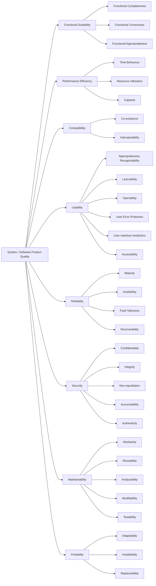

[](https://github.com/seahal/umaxica-app-jit/actions/workflows/integration.yml)


# Umaxica App (JIT)

## Routing

- `app`: for end user
- `org`: controller panel
- `com`: brand page

Multi-domain Rails application for three audience surfaces. Routing is host-constrained, so domain
and subdomain matter in both development and production.

## Stack

- Ruby `4.0.x`
- PostgreSQL
  - Solid Queue
- Valkey/Redis
- Vite Rails + Stimulus + Turbo
- Tailwind CSS via Vite
- Propshaft
- Vite and `pnpm` for JavaScript build, linting, formatting, and tests

## Frontend and Assets

- JavaScript entrypoints are bundled through Vite Rails from `src/entrypoints`
- Stimulus controllers live in `src/controllers`
- JavaScript tests live in `spec/` and run directly with Vitest
- Browser CSS is imported once through the Vite stylesheet graph in `src/styles/application.css`
- Static non-browser assets are served by Propshaft

Useful commands:

```bash
bin/dev                         # Web, Vite, and jobs
bin/rails assets:precompile     # Production asset build
bin/rails vite:build            # Vite frontend build
bin/rails assets:clobber        # Remove compiled assets
```

## Local Setup

- Docker and Docker Compose
- Ruby `4.0.x`
- Bundler
- Node.js `22.13+`
- `pnpm@11.0.8`

Start the local stack, install dependencies, and boot the app:

```bash
docker compose up
bundle install
pnpm install
bin/setup
```

`docker compose up` starts the `core` service with `bin/dev`. The PostgreSQL services use Compose
environment variables instead of inline fixed credentials:

```bash
POSTGRESQL_USER=root
POSTGRESQL_PASSWORD=development_password
POSTGRESQL_DATABASE=db
POSTGRESQL_REPLICATION_USER=replicator
POSTGRESQL_REPLICATION_PASSWORD=development_replication_password
```

The values above are local defaults only. Override them in your shell or local Compose environment
when you need different credentials.

WebAuthn trusted origins are derived from the public Auth host variables used by browser-facing
links:

```bash
PUBLIC_AUTH_SERVICE_URL=auth.umaxica.app
PUBLIC_AUTH_CORPORATE_URL=auth.umaxica.com
PUBLIC_AUTH_STAFF_URL=auth.umaxica.org
```

`TRUSTED_ORIGINS` remains available only for additional explicit origins.

`bin/setup` installs Ruby gems, runs `bin/rails db:prepare`, clears logs and temp files, then starts
`bin/dev`. It does not install JavaScript packages, so run `pnpm install` first.

If dependencies are already installed, you can start development directly:

```bash
bin/dev
```

`bin/dev` is the unified local entrypoint. It runs `bin/rails db:prepare` unless
`SKIP_DB_PREPARE=1`, then starts:

- `web`: Rails server on port `3000`
- `vite`: `bin/vite dev`
- `jobs`: `bin/jobs start`

## Development URLs

Modern browsers resolve `*.localhost` to `127.0.0.1`, so extra `/etc/hosts` entries are usually not
needed.

| Surface | URL                                        |
| :------ | :----------------------------------------- |
| Acme    | `http://www.{app,com,org}.localhost:3001`  |
| Sign    | `http://sign.{org,com,app}.localhost:3000` |
| Jump    | `http://jump.{app,com,org}.localhost:3001` |

## コード品質

本プロジェクトのコード品質は、ISO/IEC 25010 の System / Software Product
Quality モデルに基づいて整理する。以降の `Linting and Formatting` / `Testing` /
`Security and Quality Checks` は、この品質特性をそれぞれ運用面で支えるための具体的手段に対応する。



## Linting and Formatting

```bash
bundle exec rubocop
bundle exec rubocop -a
bundle exec erb_lint .
bundle exec erb_lint -a .
pnpm check
pnpm fix
```

Use `rubocop -a`, `erb_lint -a .`, and `pnpm fix` to apply auto-fixes where available.

## Testing

### Rails Tests

```bash
bundle exec rails test
COVERAGE=true bundle exec rails test
```

Coverage reports are written to `coverage/rails/`.

### JavaScript Tests

Run JavaScript tests with Vitest:

```bash
pnpm test
pnpm test:watch                            # Watch mode
pnpm test:coverage
```

JavaScript tests are located in `spec/` and use Vitest. Coverage reports are written under
`coverage/vite/`.

## Security and Quality Checks

```bash
bundle exec brakeman --no-pager
bundle exec bundler-audit check --update
bundle exec database_consistency
pnpm audit
bin/debride
```

`bin/debride` is configured for Rails-aware analysis and can also be scoped to specific paths:

```bash
bin/debride app/services
DEBRIDE_MINIMUM=5 bin/debride
```

## Logging

Application logging is structured. Prefer event-style logging over ad hoc `Rails.logger` calls when
adding domain events or operational signals.

```ruby
Rails.event.notify("user.created", user_id: user.id)
Rails.event.tagged("auth") { Rails.event.notify("login.success", user_id: user.id) }
```

## Pre-commit Checks

Run the Lefthook pre-commit checks before committing:

```bash
lefthook run pre-commit
```

These checks cover formatting, linting, security audits, database consistency, and Rails tests.

## Troubleshooting

| Problem                                  | Fix                                                       |
| :--------------------------------------- | :-------------------------------------------------------- |
| Tailwind changes are not reflected       | Run `bin/rails assets:clobber` and restart `bin/dev`      |
| Tests fail because databases are missing | Run `bin/rails db:prepare`                                |
| `bin/dev` stops during boot              | Check `PUBLIC_AUTH_*_URL` and database availability       |
| Credentials cannot be decrypted          | Use the shared Rails credentials key for this environment |

## Acknowledgement

- Secrets must stay in Rails credentials; do not commit plaintext secrets.
- WebAuthn origins are derived from `PUBLIC_AUTH_*_URL`; `TRUSTED_ORIGINS` is additive only.
- Public availability of this repository is not guaranteed permanently.
