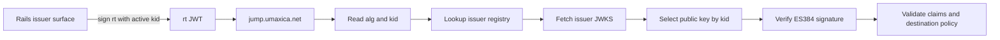
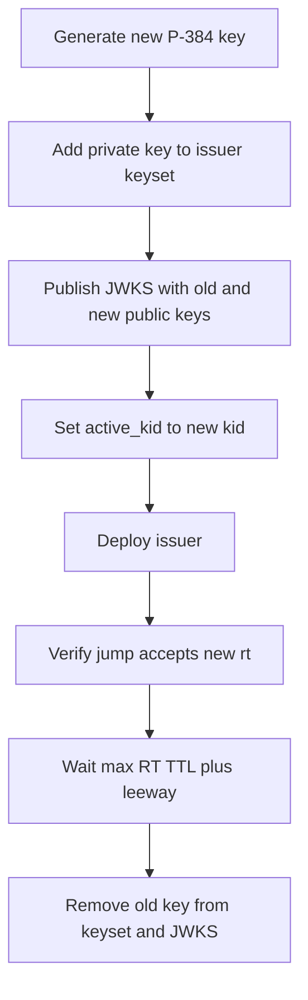

# Jump RT JWT Key Rotation

## Purpose

This runbook manages ES384 signing keys used by Rails issuer surfaces to issue Jump redirect
tokens for `https://jump.umaxica.net/?rt=<JWT>`.

Jump redirect tokens are not authentication tokens. JWT key management may share one naming and
rotation model, but the Jump RT signing key material is scoped to each issuer FQDN surface.

Issuer surfaces:

- `sign_app`
- `sign_com`
- `sign_org`
- `acme_app`
- `acme_com`
- `acme_org`
- `core_app`
- `core_com`
- `core_org`

## Key Material

Development and test private keys must be stored in Rails credentials and read through
`Rails.app.creds`. Production should read the same logical private key from the production secret
backend, such as Cloud KMS or Secret Manager.

Active `kid` values and public JWKS arrays may be configured through environment variables.
`docker/core/env` may contain those public values for local development, but it must not contain
private keys.

Environment variable naming:

```text
JWT_<SIGN|ACME|CORE>_<APP|COM|ORG>_ACTIVE_KID
JWT_<SIGN|ACME|CORE>_<APP|COM|ORG>_PUBLIC_KEYSET
```

Private key credential naming:

```text
JWT_<SIGN|ACME|CORE>_<APP|COM|ORG>_PRIVATE_KEY
```

Example:

```bash
JWT_SIGN_APP_ACTIVE_KID=sign-app-es384-2026-05-a
JWT_SIGN_APP_PUBLIC_KEYSET='[{"kty":"EC","crv":"P-384","kid":"sign-app-es384-2026-05-a","alg":"ES384","use":"sig","x":"...","y":"..."}]'
```

The corresponding development/test private key belongs in Rails credentials:

```yaml
JWT_SIGN_APP_PRIVATE_KEY: "<base64 DER or PEM private key>"
```

The exact private-key storage adapter may differ by environment, but the application-facing contract
should stay the same:

- find issuer surface;
- read the issuer surface `ACTIVE_KID`;
- read that issuer surface `PRIVATE_KEY` only when signing new `rt` JWTs;
- expose the issuer surface `PUBLIC_KEYSET` from `/.well-known/jwks.json`.

## Key States

- `active`: used for new signing and exposed in JWKS.
- `grace`: verification only; exposed in JWKS until old `rt` JWTs expire.
- `retired`: removed from JWKS during normal operation.
- `revoked`: rejected by `jump.umaxica.net` even if a stale JWKS cache still contains it.

The active private key is a single value. Public keys are an array so active and grace keys can be
published together. Retirement is removing a public key from `PUBLIC_KEYSET` after the grace window.
Revocation is configured in the edge Jump issuer registry as `revoked_kids`.

## Manual Rotation

1. Choose the issuer surface, for example `sign_app`.
2. Generate a new P-384 private key for ES384 signing.
3. Assign a unique `kid`, for example `sign-app-jump-rt-es384-2026-06-a`.
4. Store the new private key in the issuer surface private-key secret.
5. Keep the old `active_kid` unchanged and deploy, if a staged rollout is desired.
6. Add the new public JWK to the issuer surface `PUBLIC_KEYSET` without removing the old public JWK.
7. Update `active_kid` to the new `kid`.
8. Deploy the issuer application.
9. Issue a test Jump RT JWT and confirm its JWT header contains the new `kid` and `alg: ES384`.
10. Confirm `jump.umaxica.net` accepts the new token.
11. Keep the old key in JWKS for `max Jump RT TTL + clock leeway`.
12. Remove the old public JWK from the issuer surface `PUBLIC_KEYSET`.
13. Verify JWKS no longer exposes the old `kid`.
14. Confirm new tokens are still signed with the new `kid`.

## Emergency Revocation

If a private key may be compromised:

1. Add the compromised `kid` to the edge Jump issuer registry `revoked_kids`.
2. Deploy edge Jump immediately.
3. Generate a replacement P-384 key and assign a new `kid`.
4. Store the replacement private key in the issuer surface private-key secret.
5. Set `active_kid` to the replacement `kid`.
6. Deploy the issuer application.
7. Remove the compromised public JWK from the issuer surface `PUBLIC_KEYSET`.
8. Confirm JWKS no longer exposes the compromised `kid`.
9. Confirm `jump.umaxica.net` rejects a token signed with the compromised `kid`.
10. Review logs by `kid`, issuer, destination host, and `jti`. Do not log full JWTs.

## JWKS Requirements

`/.well-known/jwks.json` must return only public JWK values.

For Jump RT ES384 keys, each JWK should include:

```json
{
  "kty": "EC",
  "crv": "P-384",
  "kid": "sign-app-jump-rt-es384-2026-06-a",
  "alg": "ES384",
  "use": "sig",
  "x": "...",
  "y": "..."
}
```

The JWKS response must not contain private key fields such as `d`, PEM bodies, DER blobs, secret
backend names, or raw credential values.

## Validation Checklist

Before rotating in production:

- The new `kid` is unique across all issuer surfaces.
- The new key is P-384 and signs with `ES384`.
- The issuer FQDN JWKS exposes the new public key.
- The edge Jump issuer registry points to the issuer FQDN JWKS URI.
- The edge Jump verifier allows `ES384`.
- The issuer surface `iss` claim exactly matches the registry issuer.
- The token `aud` is `https://jump.umaxica.net`.
- The token includes `schema`, `sub`, `iat`, `nbf`, `exp`, `jti`, `dst`, and `url`.
- The destination URL is allowed by the edge Jump issuer policy.

## OpenSSL Example

Generate a P-384 private key:

```bash
openssl ecparam -name secp384r1 -genkey -noout -out jump-rt-private.pem
openssl ec -in jump-rt-private.pem -pubout -out jump-rt-public.pem
```

Convert to DER and base64 if the configured secret format is base64 DER:

```bash
openssl ec -in jump-rt-private.pem -outform DER | base64
```

Keep the private key out of git, logs, tickets, screenshots, and chat.

## Verification Flow



## Rotation Flow


