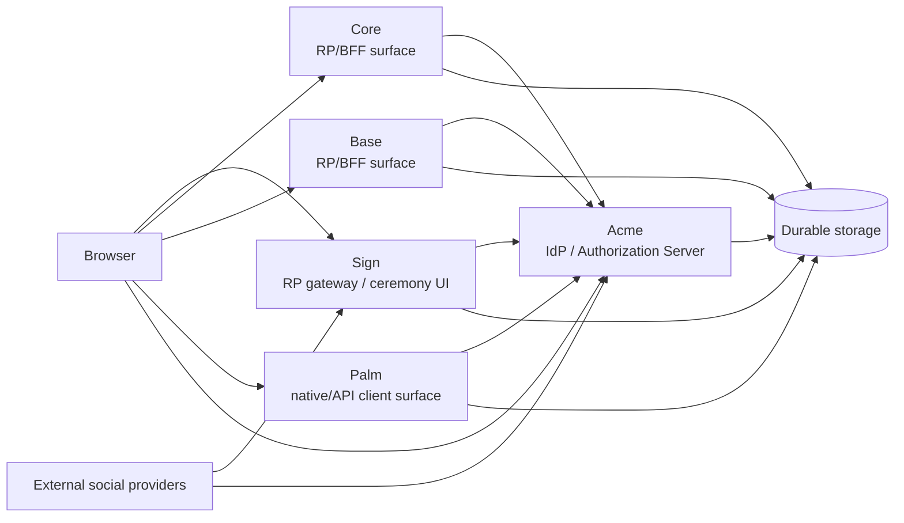

# Purpose

Describe the current identity and control-plane architecture as evidenced in the repository.

# Scope

This document covers current hosts, surfaces, protocol boundaries, browser/session placement, and
the evidence for current frontend tooling.

# Non-scope

This is not a target architecture proposal. It does not reassign authority beyond what is already
evidenced.

# Source Evidence

- `config/routes/acme.rb`
- `config/routes/sign.rb`
- `config/routes/core.rb`
- `config/routes/base.rb`
- `config/routes/palm.rb`
- `test/integration/routes/acme_route_contract_test.rb`
- `test/integration/routes/sign_route_contract_test.rb`
- `test/integration/routes/core_route_contract_test.rb`
- `test/integration/routes/base_route_contract_test.rb`
- `test/integration/routes/palm_route_contract_test.rb`
- `test/integration/routes/oidc_discovery_route_stability_test.rb`
- `docs/identity/authority-boundary.md`
- `docs/security/session-token-authority.md`
- `docs/security/credential-gateway.md`
- `docs/security/social-callback-boundary.md`
- `adr/acme-sign-core-base-port-boundary.md`
- `adr/frontend-architecture-toolchain.md`

# Current Architecture

The repository currently evidences these surfaces:

- Acme: sole IdP / Authorization Server and durable session/token authority.
- Sign: RP gateway and ceremony UI.
- Core: RP/BFF surface with browser session and token refresh behavior.
- Base: RP/BFF-style Rails control-plane surface.
- Palm: native/API client surface that uses bearer tokens.
- Browser: the user agent that carries cookies, follows redirects, and hosts ceremony forms.
- External social providers: Google and Apple are evidenced in social login and callback routes.
- Email/SMS providers: email OTP and telephone OTP routes and services are evidenced, but the
  specific delivery vendor is not the focus of this package.
- Database/storage surfaces: route contracts and authority docs evidence durable
  identity/session/token data, ceremony state, and controller-backed state on the application
  database side.
- Frontend tooling: Rails + Vite + Turbo + Stimulus + React/Inertia are evidenced.

Hono and React Router are not current repository evidence unless a future repository change adds
them.

## Architecture Summary

## Boundary Distinctions

- IdP / Authorization Server: Acme only.
- RP gateway: Sign.
- RP/BFF surfaces: Core and Base.
- Native/API client surface: Palm.
- Social provider callback: `/social/*` routes and social callback controllers, not OAuth token
  issuance.
- OIDC callback: `/oidc/*` RP client callback flow on RP surfaces.
- Browser session: host-local browser session and cookie transport.
- OAuth/OIDC tokens: Acme-issued protocol tokens.
- Ceremony state: short-lived state used to complete credential or social ceremonies.

## Evidence Notes

- Acme routes expose `/oauth/*`, `/oidc/*`, JWKS, discovery, and logout endpoints.
- Sign routes expose `/sign/in/*`, `/sign/up/*`, `/sign/out/*`, social callback routes, and
  settings/session UI.
- Core routes expose RP/BFF APIs, OIDC client routes, and browser sign-out.
- Base routes expose RP/BFF client routes and browser sign-out.
- Palm routes expose native API and OIDC client callback compatibility.

# Current Decisions

- Acme is the only Authorization Server.
- Sign is an RP gateway and ceremony UI.
- Core and Base are RP/BFF surfaces.
- Palm is a native/API client surface.
- Browser state and cookies are host-local transports, not authority.

# Open Questions

- Whether any missing controller or service evidence should be added to the documentation set later.

# Related Documents

- `docs/vendor/identity/00_readme.md`
- `docs/vendor/identity/02_responsibility-boundary.md`
- `docs/vendor/identity/03_route-endpoint-inventory.md`
- `docs/vendor/identity/04_cookie-session-token-matrix.md`
- `docs/vendor/identity/05_authentication-flow-inventory.md`
- `docs/vendor/identity/08_threat-model.md`
- `docs/security/session-token-authority.md`
- `docs/security/credential-gateway.md`
- `docs/security/social-callback-boundary.md`
