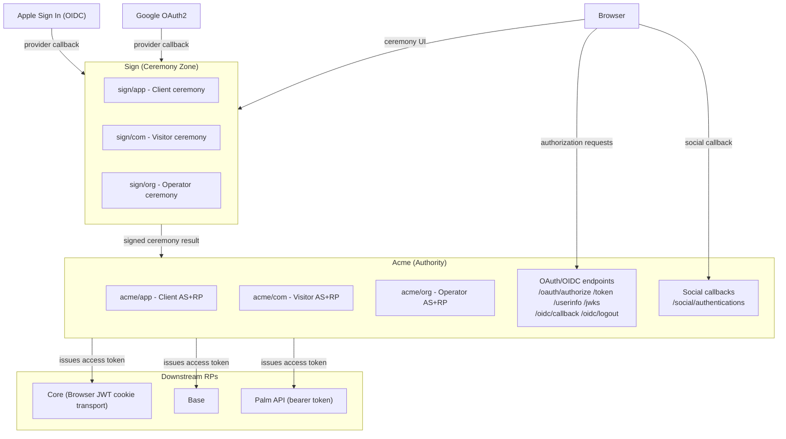

# Umaxica 認証認可基盤 — 発注前デューデリジェンス 監査台帳 (Round 1)

> MODE: AUDIT_AND_GRILL | WRITE_ACCESS: OFF | DATE:
> 2026-06-24 監査委員会構成: エンタープライズアーキテクト / OAuth2・OIDC・WebAuthn 専門家 / IAM/CIAM
> / AppSec / Rails / SRE / QA / SIer調達 / 技術文書レビュー

---

## 0. リポジトリ状態確認

| 項目      | 確認値                                                           |
| --------- | ---------------------------------------------------------------- |
| branch    | develop                                                          |
| HEAD      | c171e4706656200591d74ebcbcef1c291d17b1b8                         |
| modified  | 66 files                                                         |
| deleted   | 2 files (session_limit_resolutions_controller.rb, show.html.erb) |
| untracked | 3 files                                                          |
| submodule | なし                                                             |
| monorepo  | なし (single Rails app)                                          |

---

## 1. 証拠台帳 — Round 1

### FACT (コード・設定・文書から直接確認)

| ID       | 内容                                                                                                                                    | 根拠ファイル                                                                  | confidence |
| -------- | --------------------------------------------------------------------------------------------------------------------------------------- | ----------------------------------------------------------------------------- | ---------- |
| FACT-001 | Acme が唯一の IdP/AS。セッション・トークン・OIDC・access token の権威                                                                   | docs/security/session-token-authority.md, docs/security/sign-in-sequence.md   | High       |
| FACT-002 | Sign は credential ceremony 専用。セッション発行・トークン発行・失効は禁止                                                              | docs/security/credential-gateway.md, docs/security/session-token-authority.md | High       |
| FACT-003 | 3 surface: app(Client) / com(Visitor) / org(Operator)。各 surface は独立境界                                                            | ApplicationController per surface, routes                                     | High       |
| FACT-004 | AUTHENTICATION_MODE 定数パターン: deny_all / private / open / bare                                                                      | 全 ApplicationController, BareController                                      | High       |
| FACT-005 | BareController は ActionController::Base 直継承。RateLimit + CSRF は保持するが認証コールバックなし                                      | app/controllers/{acme,sign,base}/\*/bare_controller.rb                        | High       |
| FACT-006 | 認証方式: email OTP / passkey(WebAuthn) / TOTP / recovery passcode / Google / Apple                                                     | docs/security/sign-in-sequence.md, controller inventory                       | High       |
| FACT-007 | Refresh token: digest 保存、family ID 管理、rotation 実装済                                                                             | app/models/concerns/oidc_token_usage.rb, refresh_tokenable.rb                 | High       |
| FACT-008 | Session limit: app=2+1, com=1+1, org=1+1 (active+restricted)                                                                            | docs/security/session-limit.md                                                | High       |
| FACT-009 | JWT 署名アルゴリズム: ES384 のみ (RS256 非対応、意図的 private profile)                                                                 | docs/security/oidc-discovery-profile.md                                       | High       |
| FACT-010 | DPoP 実装あり: dpop_proof_validator.rb, dpop_request_verifier.rb                                                                        | app/services/                                                                 | High       |
| FACT-011 | ChainSeal 実装は docs/security/chain_seal.md に記述があるが、"not yet in production"                                                    | docs/security/chain_seal.md                                                   | High       |
| FACT-012 | Auth cookie: \_\_Host- prefix (production), SameSite=Strict, HttpOnly, Secure                                                           | app/controllers/concerns/authentication*cookie*{name,service}.rb              | High       |
| FACT-013 | OAuth 2.1 compliance gap note 存在。複数の open item あり (単一使用 auth code, PKCE per-RP 検証, bearer in query string, HTTP 307 etc.) | notes/oauth2-1-compliance-gap.md                                              | High       |
| FACT-014 | Security audit 2026-06-13: 4 findings (Critical×1, High×3)。全件に決定と test coverage あり                                             | adr/security-audit-findings-2026-06-13.md                                     | High       |
| FACT-015 | FINDING-04: verify_authorized 欠落検出機構なし。明示的に DEFERRED (backlog)。after_action :verify_authorized 未有効化                   | adr/security-audit-findings-2026-06-13.md:FINDING-04                          | High       |
| FACT-016 | IdentityOneTimeReveal: JWT+cache によるワンタイム reveal (15分TTL)                                                                      | app/services/identity_one_time_reveal.rb                                      | High       |
| FACT-017 | Pundit → ActionPolicy 移行中 (adr/pundit-to-action-policy-migration.md)                                                                 | ADR                                                                           | High       |
| FACT-018 | Palm surface: bearer token 認証 API (authenticate_palm_bearer_token!)                                                                   | app/controllers/palm/app/api/v0/profiles_controller.rb                        | High       |
| FACT-019 | Social login: app のみ許可 (Google/Apple)。com/org は ADR で拒否確定                                                                    | adr/sign-com-no-social-login.md, docs/security/social-login-provider-scope.md | High       |
| FACT-020 | MFA reset = account recovery。Operator 承認必須、72時間 cooling                                                                         | docs/security/mfa-reset-account-recovery.md                                   | High       |
| FACT-021 | WebAuthn: TRUSTED_ORIGINS 環境変数必須 (production)。RP ID は request-time 動的解決                                                     | config/initializers/webauthn.rb                                               | High       |
| FACT-022 | CORS 無効 (config/initializers/cors.rb: currently disabled)                                                                             | config/initializers/cors.rb                                                   | High       |
| FACT-023 | session_limit_resolutions_controller.rb と show.html.erb が現ブランチで **削除**                                                        | git status                                                                    | High       |
| FACT-024 | oauth2-1-compliance-gap note: AS を "sign.\*" として記述 (stable docs の "Acme = AS" と表記が異なる)                                    | notes/oauth2-1-compliance-gap.md §Role Split Recap                            | Medium     |
| FACT-025 | Refresh token rotation grace window: 明示的に DEFERRED                                                                                  | docs/security/refresh-token-rotation.md                                       | High       |
| FACT-026 | OmniAuth: Apple は provider_ignores_state=true (app-side で SocialCallbackGuard により検証)                                             | config/initializers/omniauth.rb                                               | High       |

---

### GAP (必要だが存在しない・不足する成果物/要件)

| ID      | 内容                                                                                                     | severity | 根拠                                                       |
| ------- | -------------------------------------------------------------------------------------------------------- | -------- | ---------------------------------------------------------- |
| GAP-001 | OIDC conformance test 結果が存在しない。"private profile" を主張するが conformance evidence なし         | High     | oidc-discovery-profile.md は意図のみ記述                   |
| GAP-002 | ChainSeal は本番未導入。audit log tamper-evidence の現行機構が不明                                       | High     | chain_seal.md                                              |
| GAP-003 | Refresh token replay detection: grace window DEFERRED。family revocation の即時性が仕様化されていない    | High     | refresh-token-rotation.md                                  |
| GAP-004 | after_action :verify_authorized が全 surface で未有効化。authorize! 漏れを CI/テストが自動検出できない   | High     | security-audit-findings-2026-06-13.md FINDING-04           |
| GAP-005 | SNS リソース単位の認可マトリクスが文書として未確認 (投稿/プロフィール/フォロー/ブロック/メッセージ/通報) | High     | コードに policy ファイルは存在するが体系的 matrix 文書なし |
| GAP-006 | Palm API bearer token のライフタイム・ローテーション・失効ポリシーが security docs に未記載              | Medium   | services/palm_access_token_authenticator.rb は存在         |
| GAP-007 | OAuth 2.1 open gaps の ownership・期限が未割当 (notes/ は design-direction、ADR 未昇格)                  | High     | notes/oauth2-1-compliance-gap.md                           |
| GAP-008 | SIer 向け Responsibility Matrix が文書として未存在                                                       | Critical | docs/ に matrix 記述なし                                   |
| GAP-009 | Cookie/Session/Token Matrix が体系的文書として未存在                                                     | High     | 複数 concern に分散、統合台帳なし                          |
| GAP-010 | Threat model 文書が未確認 (security docs に脅威一覧・attack path・残存リスクの体系文書なし)              | Critical | docs/security/ inventory 確認済                            |

---

### UNKNOWN (確認できない事項)

| ID      | 内容                                                                   | why unknown                              | risk   |
| ------- | ---------------------------------------------------------------------- | ---------------------------------------- | ------ |
| UNK-001 | session_limit_resolutions_controller.rb 削除後の代替機構               | コード確認未完 (削除ファイル)            | High   |
| UNK-002 | DPoP が required か optional か、どのエンドポイントで強制されるか      | dpop.md 未読、enforcement point 未確認   | High   |
| UNK-003 | transparent_refresh_access_token 失敗時の fail-open/fail-closed 挙動   | concern 実装未読                         | High   |
| UNK-004 | Recovery passcode 検証の rate limit 具体値                             | credential-abuse-rate-limits.md 精査未完 | Medium |
| UNK-005 | 2026-06-13 audit findings の fix が現 develop ブランチに含まれているか | git log 精査未完                         | High   |

---

### CONTRADICTION (複数証拠が衝突)

| ID      | 内容                          | 証拠A                           | 証拠B                                                                                 | impact                                                      |
| ------- | ----------------------------- | ------------------------------- | ------------------------------------------------------------------------------------- | ----------------------------------------------------------- |
| CON-001 | AS の帰属表記が文書間で不一致 | stable docs: "Acme が唯一の AS" | notes/oauth2-1-compliance-gap.md §Role Split: "AS: sign.\*, owned by Identity engine" | SIer が AS の所在を誤認する可能性。委託範囲・責任分界に直結 |

---

### RISK (具体的影響を伴うリスク)

| ID      | リスク                                                                          | severity | 既存コントロール                                                                 | 欠落コントロール                                                  |
| ------- | ------------------------------------------------------------------------------- | -------- | -------------------------------------------------------------------------------- | ----------------------------------------------------------------- |
| RSK-001 | verify_authorized 欠落検出なし → 新規 action が認証通過・認可スキップ           | High     | test/unit/security/action_policy_usage_test.rb (enforce_access_policy! 存在確認) | after_action :verify_authorized の有効化                          |
| RSK-002 | Refresh token grace window DEFERRED → replay detection の即時性が未定義         | High     | family ID による revocation 機構あり                                             | grace window 決定・仕様化                                         |
| RSK-003 | ChainSeal 未本番導入 → audit log 改ざんを事後検証できない                       | Medium   | application log + Lograge                                                        | ChainSeal 本番展開 or 代替 integrity 機構                         |
| RSK-004 | CON-001: AS 帰属の文書矛盾 → SIer が Sign を AS として実装する可能性            | Critical | stable docs は明確                                                               | notes/oauth2-1-compliance-gap.md の表記修正 or 発注前の明示的説明 |
| RSK-005 | GAP-010: Threat model 未整備 → 攻撃経路・残存リスクを SIer が定義できない       | Critical | 個別セキュリティ docs は豊富                                                     | 体系的 threat model 文書                                          |
| RSK-006 | OAuth 2.1 gaps が notes/ どまり → SIer が compliance 要件を実装必須と判断しない | High     | notes 文書が存在                                                                 | ADR 昇格 + 実装要件化                                             |

---

## 2. As-Is 暫定構成 (証拠ベース)

**証拠なし構成 (UNKNOWN):**

- Identity engine (sign.\*) が AS 権威を持つ将来状態 (CON-001)
- session limit resolution の代替フロー (UNK-001)

---

## 3. 第1回 Grill ラウンド

> 優先順位: trust boundary → responsibility boundary → security model → failure behavior →
> authorization model

---

### [Q-001] session limit resolution controller の削除意図と代替機構

**背景:** 現 develop ブランチで `app/controllers/acme/app/session_limit_resolutions_controller.rb`
と `app/views/acme/app/session_limit_resolutions/show.html.erb` が削除されている。
`docs/security/session-limit.md` はセッション上限到達時に "restricted
session" を使った管理フローを規定しており、ルーティング (`config/routes/acme.rb`) に session limit
resolution エンドポイントが存在するかどうかが現時点で未確認。

**現在確認できている証拠:**

- `git status`: 2ファイル削除 (D)
- `docs/security/session-limit.md`: limit 到達時の restricted session / management flow を定義
- AUTHENTICATION_MODE = :open を使う `oauth/authorizations_controller.rb` 内に
  `start_authorization_ceremony!` と `resume_authorization!` がある

**問題:**

- 削除が意図的なリファクタリングか、作業途中の未完状態か不明
- セッション上限到達時のユーザーフローが現在コード上で実現されているか不明
- trust boundary の核心部分 (Acme がセッション上限を強制するフロー) が機能しているか検証できない

**未決のまま進んだ場合の影響:**

- 実装: SIer がセッション上限機能を「削除済み仕様」と解釈して再実装しない可能性
- セキュリティ: 上限超過時のフローが壊れていれば無制限セッション発行になる
- 検収: 「セッション上限機能が動作する」を ACC として定義できない

**回答してほしい形式:**

- この削除は意図的か、作業中か
- 代替実装はどこにあるか (ファイル名 or ルート名)
- このブランチは session limit resolution 機能が動作する状態か

---

### [Q-002] AS 権威の帰属 — stable docs vs. notes の矛盾

**背景:** `notes/oauth2-1-compliance-gap.md` §Role Split Recap に以下の記述がある:

> Identity provider (AS): `sign.*`, owned by the Identity engine Relying parties (RP): `acme`,
> `base`, `post`, and other future surfaces

一方、stable docs (docs/security/session-token-authority.md, sign-in-sequence.md,
credential-gateway.md) はいずれも「Acme が唯一の IdP/AS」「Sign は ceremony のみ」と明言している。

**現在確認できている証拠:**

- CON-001 として台帳に登録済み
- `notes/` は "non-authoritative" と AGENTS.md が明記
- `plans/active/identity-zenith-foundation-distributor-implementation-plan.md` が Identity
  engine スコープとして AS 責務を扱うと notes に記述

**問題:**

- この矛盾は「将来の移行計画」vs「現在の設計」のどちらを notes が記述しているのか不明
- SIer がこの notes を読んだ場合、Sign を AS として実装するリスクがある (RSK-004: Critical)
- 発注前に notes の表記を修正・封印しないと、RFP の interpretation が分岐する

**未決のまま進んだ場合の影響:**

- 契約: "AS を実装する" の範囲を Sign と Acme で SIer が誤って定義
- セキュリティ: AS 権威が Sign に漏れることで session/token 境界が崩壊
- 検収: どの surface が AS か合意なしに成果物を検収できない

**回答してほしい形式:**

- notes/oauth2-1-compliance-gap.md の AS 帰属記述は「将来の移行先」を示しているのか、「現在の誤記」か
- Identity engine が実装された後も Acme が AS 権威を持ち続けるのか、それとも Sign に移行するのか
- この migration の timeline と、発注前に notes を修正する予定はあるか

---

### [Q-003] verify_authorized 欠落検出機構の risk owner と timeline

**背景:** `adr/security-audit-findings-2026-06-13.md` FINDING-04 は:「ActionPolicy で
`after_action :verify_authorized` が有効化されていないため、新規 action が `authorize!`
を省略しても CI・テストが検出できない」と記録し、明示的に **DEFERRED** とした。

**現在確認できている証拠:**

- `test/unit/security/action_policy_usage_test.rb` が `enforce_access_policy!` の存在を assert
  (authentication bypass 防止のみ)
- `after_action :verify_authorized` は全 surface ApplicationController で未有効化 (CODE_ONLY 確認)
- ADR に "Long-term recommendation" として backlog 追跡を推奨と記述

**問題:**

- この gap を受容した risk owner が明記されていない
- backlog item が存在するかどうか未確認 (plans/backlog/ 未精査)
- SIer が新規 action を追加した場合、`authorize!` 漏れを内製チームが検出できる保証がない
- "SIer 実装 + 内製レビュー" の体制では、この structural gap がそのまま引き継がれる

**未決のまま進んだ場合の影響:**

- セキュリティ: SIer 実装の新規 action に authorize! 漏れが混入 → production で IDOR/BOLA
- 運用: 発覚が penetration test またはインシデント時になる
- 契約: 「認可テスト済み」の検収条件を定義できない

**回答してほしい形式:**

- この gap の risk acceptance owner は誰か
- `after_action :verify_authorized` 有効化の target milestone / 担当者はあるか
- SIer 実装範囲でこの gap を閉じる責任は SIer か内製か

---

### [Q-004] OAuth 2.1 compliance gap の ownership と発注前クローズ対象

**背景:** `notes/oauth2-1-compliance-gap.md` に以下の open item が列挙されている:

| 要件                         | 現状                                                   |
| ---------------------------- | ------------------------------------------------------ |
| PKCE S256 (all clients)      | "Implementation coverage should be re-verified per RP" |
| Auth code 単一使用           | "Requires explicit test coverage"                      |
| Confidential client 認証     | "#611 hardening. Needs verification per client type"   |
| Refresh token rotation       | "Tracked in backlog #558"                              |
| DPoP                         | "Tracked in backlog #573"                              |
| Bearer token in query string | "Needs repository audit"                               |
| HTTP 307 redirect            | "Needs verification of current redirect codes"         |

**現在確認できている証拠:**

- notes/ は "non-authoritative" (AGENTS.md)
- これらの項目を ADR に昇格したものは adr/refresh-revoke-aal-downgrade-and-replay-hardening.md 等で一部あり
- notes/ どまりの items は "設計方向" に留まり、実装要件として確定していない

**問題:**

- SIer が RFP を読んだとき、これらが「実装済み」「実装必要」「対象外」のどれかが判断できない
- auth code 単一使用の test coverage 不足は OAuth 2.1 準拠の核心
- "OAuth/OIDC 準拠" を contract に記載した場合、どの profile の何の機能が対象か合意できない

**未決のまま進んだ場合の影響:**

- 契約: "OIDC 準拠" の scope が不明で紛争リスク
- 検収: conformance test の evidence 要件が定義できない
- セキュリティ: auth code replay や PKCE bypass が production 混入の可能性

**回答してほしい形式:**

- 発注前に ADR 化・実装確認を完了すべき items はどれか (MUST vs. 将来)
- "OAuth/OIDC 準拠" を contract に含める場合、主張する profile と scope は何か
- notes/ の gap を SIer 向け RFP に含めるか除外するか

---

### [Q-005] transparent_refresh_access_token の fail-open / fail-closed 挙動

**背景:** Core (app/com/org) の ApplicationController に
`before_action :transparent_refresh_access_token` が登録されている。このメソッドは access
token の透過的リフレッシュを行うと推定されるが、実装の fail behavior を未確認。

**現在確認できている証拠:**

- `app/controllers/core/app/application_controller.rb:62` 他
- Acme はトークン発行権威。Core は downstream RP。
- Access token TTL は `SecurityTokenLifetimes::AUTH_ACCESS_JWT_TTL` で管理

**問題:**

- refresh 失敗時 (cache down / DB down / token revoked) にリクエストが続行するか失敗するか不明
- fail-open の場合: 失効済み credential でリソースアクセスが継続する
- fail-closed の場合: インフラ障害時に全 Core ユーザーが強制ログアウト
- どちらの設計かは NFR と SLA 設計に直接影響する

**未決のまま進んだ場合の影響:**

- セキュリティ: fail-open なら revoked credential が有効期間中アクセス継続
- 運用: fail-closed の場合の cascade failure シナリオが未定義
- 契約: 可用性 SLA と session 失効保証がトレードオフになる条件が不明

**回答してほしい形式:**

- transparent_refresh が失敗した場合の挙動 (fail-open / fail-closed / どちら)
- この決定は明示的に設計されたか、実装の暗黙挙動か
- キャッシュ (Valkey) 障害時とトークン失効時で挙動が分岐するか

---

### [Q-006] SNS リソース単位の認可マトリクスの存在

**背景:**
Umaxica は SNS に近いプロダクト。投稿・プロフィール・フォロー・ブロック・メッセージ・通報・組織管理などオブジェクト単位の認可が必要なリソースが多数存在する。Pundit
→ ActionPolicy 移行中であり、policy ファイルは複数確認されているが、体系的な **認可マトリクス文書**
が docs/ に存在するかは未確認。

**現在確認できている証拠:**

- `adr/pundit-to-action-policy-migration.md` が移行を記録
- `app/policies/` に policy ファイルが存在
- FINDING-04 で "object-level authorization" の structural gap が確認された
- `docs/authorization_guide.md` と `docs/spec/authorization_guide.md` の存在を確認 (内容未読)

**問題:**

- SNS 固有のリソース (タイムライン、フォロー関係、ブロック、通報) の認可設計が文書化されているか不明
- IDOR/BOLA のリスクが policy カバレッジ不明のまま
- SIer がリソース追加する際にどの policy パターンに従えばよいか不明

**未決のまま進んだ場合の影響:**

- セキュリティ: 新規リソースに IDOR が混入
- 設計: SIer が独自の認可パターンを持ち込む
- 検収: 「認可が正しく実装されている」の acceptance criteria が定義不能

**回答してほしい形式:**

- SNS リソース単位の認可マトリクスは存在するか (docs/ or plans/)
- 現在の policy ファイルのカバレッジを把握している担当者は誰か
- SIer が新規リソースを追加する場合の認可実装ガイドラインはあるか

---

### [Q-007] Recovery passcode のブルートフォース防御の具体的仕様

**背景:** Recovery passcode は account recovery の最終手段。`IdentityOneTimeReveal` は 15分TTL +
cache-based single-use を実装。 `RecoveryPasscodeTopUp` は 10個を target として管理。
`docs/security/credential-abuse-rate-limits.md` が rate
limit を定義しているが、passcode 検証 endpoint に適用される具体的な limit 値を未確認。

**現在確認できている証拠:**

- `app/services/identity_one_time_reveal.rb`: JWT 発行 + cache 管理
- `docs/security/credential-abuse-rate-limits.md` 存在を確認 (内容精査未完)
- `docs/security/mfa-reset-account-recovery.md`: MFA reset は Operator 承認必須・72h cooling

**問題:**

- passcode 10個の総当たりに何回試行を要するか、その前に rate limit が発動するか不明
- passcode の長さ・entropy が不明
- OTP と passcode の rate limit が同一の仕組みか別かが不明
- 最終手段の credential が brute force 耐性を持つかどうかは threat model の核心

**未決のまま進んだ場合の影響:**

- セキュリティ: recovery passcode が account takeover の最弱リンクになる
- 設計: SIer が passcode 検証を実装する際の abuse prevention 要件が不明
- 検収: brute force 耐性のテスト evidence が定義できない

**回答してほしい形式:**

- passcode の文字数・文字種・entropy
- 検証 endpoint の rate limit (burst / sustained / lockout)
- lockout 後の recovery パス (support escalation, Operator 介入等)

---

## 4. Round 1 終了時の台帳状態

| 種別          | 件数               |
| ------------- | ------------------ |
| FACT          | 26                 |
| GAP           | 10                 |
| UNKNOWN       | 5                  |
| CONTRADICTION | 1                  |
| RISK          | 6                  |
| DECISION      | 0 (Round 1 未回答) |

**発注 Readiness 暫定判定: NOT READY**

Critical blocker:

- GAP-008: Responsibility Matrix 未存在
- GAP-010: Threat model 文書未存在
- CON-001: AS 帰属矛盾 → SIer 誤実装リスク (RSK-004)
- GAP-004: verify_authorized structural gap (RSK-001)

次ラウンドで確認するテーマ (回答を受けてから決定):

- Q-001〜Q-007 の回答による DECISION 確定と UNKNOWN 解消
- DPoP enforcement status (UNK-002)
- transparent_refresh_access_token 実装読み込み (UNK-003)
- recovery passcode rate limit 仕様 (UNK-004)
- plans/backlog/ の verify_authorized item 存在確認

---

_この台帳は WRITE_ACCESS=OFF モードで作成。ファイル変更はなし。_
_次ラウンドは Q-001〜Q-007 の回答を受けてから開始。_
