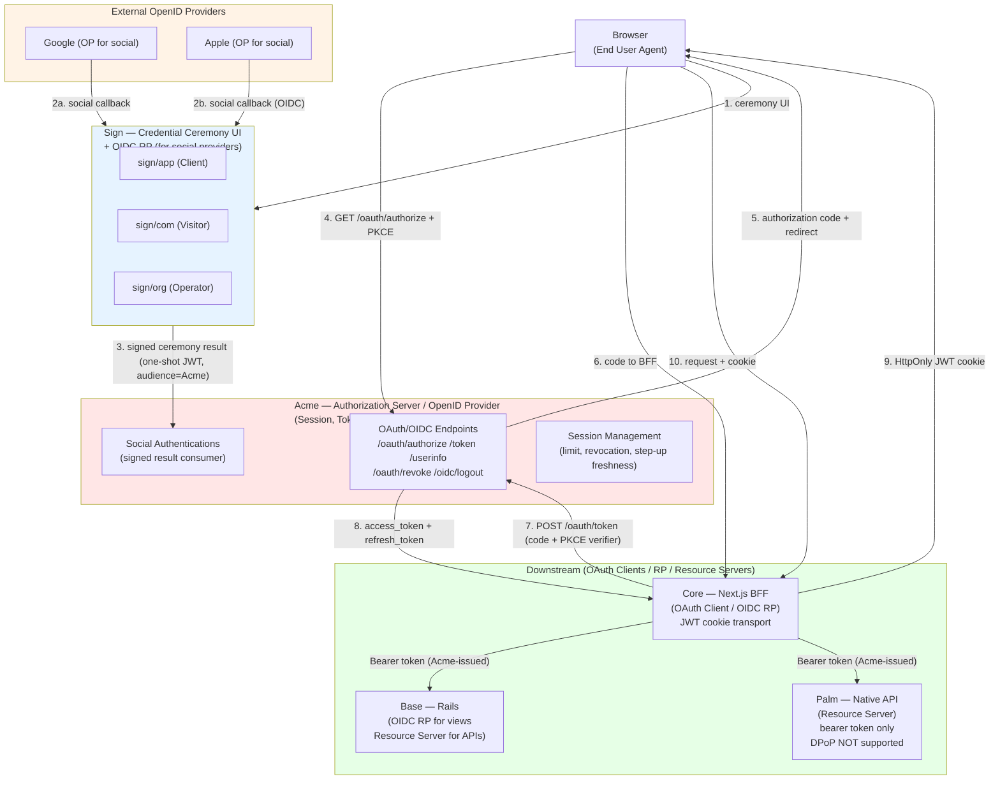

# Umaxica 認証認可基盤 — 発注前デューデリジェンス 監査台帳 (Round 4)

> MODE: AUDIT_AND_GRILL | WRITE_ACCESS: OFF | DATE:
> 2026-06-24 監査委員会: エンタープライズアーキテクト / OAuth2・OIDC・WebAuthn 専門家 / IAM/CIAM /
> AppSec / Rails / SRE / QA / SIer調達 / 技術文書レビュー

---

## 0. リポジトリ状態

| 項目                                    | HEAD (c171e4706) | WORKTREE                                               |
| --------------------------------------- | ---------------- | ------------------------------------------------------ |
| branch                                  | develop          | develop                                                |
| session_limit_resolutions_controller.rb | 存在             | 削除済み → sign/in/limitations_controller.rb に rename |
| 変更ファイル                            | —                | 66 modified, 2 deleted, 3 untracked                    |

---

## 1. DECISION Register (全ラウンド統合)

| ID      | 内容                                                                                                                                                                                                                                                                                                                                                          | Owner                      | 期限                            | Source   |
| ------- | ------------------------------------------------------------------------------------------------------------------------------------------------------------------------------------------------------------------------------------------------------------------------------------------------------------------------------------------------------------- | -------------------------- | ------------------------------- | -------- |
| DEC-001 | notes/oauth2-1-compliance-gap.md を SIer 初回接触前に封印 (渡す場合は obsolete 明記)                                                                                                                                                                                                                                                                          | 内製アーキテクチャオーナー | RFI 前                          | Q-R2-001 |
| DEC-002 | notes/oauth2-1-compliance-gap.md は RFP 前に修正または archive 化                                                                                                                                                                                                                                                                                             | 内製アーキテクチャオーナー | RFP 前                          | Q-R2-001 |
| DEC-003 | verify_authorized gap の risk acceptance owner = 内製アーキテクチャオーナー                                                                                                                                                                                                                                                                                   | 内製                       | 確定                            | Q-R2-002 |
| DEC-004 | verify_authorized gap: SIer 実装範囲の authorize! coverage evidence は SIer 責任。既存基盤への framework-level 導入は内製責任                                                                                                                                                                                                                                 | 内製+SIer                  | SIer 契約時                     | Q-R2-002 |
| DEC-005 | Recovery passcode rate limit なし = 未対応 gap として remediation 対象 (intentional design ではない)                                                                                                                                                                                                                                                          | 内製                       | 実装前に仕様化                  | Q-R2-003 |
| DEC-006 | DPoP は production mandatory requirement として固定しない。opt-in infrastructure として維持                                                                                                                                                                                                                                                                   | 内製                       | 確定                            | Q-R2-004 |
| DEC-007 | SIer 向け認可ガイド = docs/authorization_guide.md (Action Policy 版) を使用。docs/spec/authorization_guide.md は非 authoritative                                                                                                                                                                                                                              | 内製                       | SIer 接触前                     | Q-R2-005 |
| DEC-008 | **GQ-01 CLOSED (初期リリース):** social identity linking の primary key は provider+uid/sub に限定。email matching による自動 linking は OUT_OF_SCOPE。将来の explicit linking ceremony は DEFERRED (authenticated session + explicit user action + audit 必須)                                                                                               | 内製                       | 確定                            | Q-R3-001 |
| DEC-009 | **MFA reset UI は DISABLED のまま維持**。有効化の前提条件: Account Recovery Runbook / MFA Reset State Machine / Abuse Protection / Audit Requirements / Acceptance Criteria の完成。SIer 実装範囲に含める場合は UI 単体ではなく operator workflow + audit evidence まで成果物に含める                                                                         | 内製                       | RFP 前に仕様化                  | Q-R3-002 |
| DEC-010 | **08_threat-model.md の扱い:** RFI では "context only / not normative / subject to internal approval" と明記して参考資料として渡すのは可。RFP 前には owner・review date・approval status・scope・residual risk owner を確定する                                                                                                                               | 内製 security owner        | RFP 前                          | Q-R3-003 |
| DEC-011 | **GQ-04 CLOSED (hardened policy):** 同一 credential・purpose・time-step で成功した TOTP は再使用禁止。clock skew window は許容するが accepted successful time-step は再使用不可。replay rejection は audit 対象                                                                                                                                               | 内製                       | 確定                            | Q-R3-004 |
| DEC-012 | **GQ-05 CLOSED (fail-closed):** token endpoint は browser session に依存しない back-channel protocol endpoint。null_session または required protocol context 欠如時は deterministic OAuth error を返しトークン不発行。test coverage 必須                                                                                                                      | 内製                       | 確定                            | Q-R3-004 |
| DEC-013 | **Audit log integrity = 必須セキュリティ要件:** critical security audit events は application boundary で append-only 必須。update/delete の防止または検出可能性が必要。application-level sanitization + event_uuid UNIQUE だけでは不足。短期: DB-level append-only または tamper-evidence 検討。長期: ChainSeal production 導入は future hardening candidate | 内製                       | RFP 前に対象 event class を定義 | Q-R3-005 |

---

## 2. FACT Register (全ラウンド統合)

| ID       | 内容                                                                                                                                                     | Baseline | Evidence Type | Confidence |
| -------- | -------------------------------------------------------------------------------------------------------------------------------------------------------- | -------- | ------------- | ---------- |
| FACT-001 | Acme が唯一の IdP/AS。コード (oidc_issuer.rb) で ACME_APP/ORG/COM namespace を使用                                                                       | BOTH     | CODE+DOC+ADR  | High       |
| FACT-002 | Sign は ceremony 専用 (session/token 発行禁止)                                                                                                           | BOTH     | CODE+DOC+ADR  | High       |
| FACT-003 | 3 surface: app(Client) / com(Visitor) / org(Operator)                                                                                                    | BOTH     | CODE          | High       |
| FACT-004 | AUTHENTICATION_MODE 定数パターン (deny_all / private / open / bare)                                                                                      | BOTH     | CODE          | High       |
| FACT-005 | BareController: ActionController::Base 直継承。RateLimit+CSRF は保持                                                                                     | BOTH     | CODE          | High       |
| FACT-006 | 認証方式: email OTP / passkey / TOTP / recovery passcode / Google (app only) / Apple (app only)                                                          | BOTH     | CODE+DOC      | High       |
| FACT-007 | Refresh token: digest 保存 + family ID + rotate_refresh_token! 実装済み                                                                                  | BOTH     | CODE          | High       |
| FACT-008 | Session limit: app=2+1, com=1+1, org=1+1 (active+restricted)                                                                                             | BOTH     | DOC+CODE      | High       |
| FACT-009 | JWT 署名: ES384 のみ (意図的 private profile。RS256 非対応)                                                                                              | BOTH     | CODE+DOC      | High       |
| FACT-010 | DPoP: opt-in インフラ。token issuance 時に client が提供すれば bound token が発行される                                                                  | BOTH     | CODE+DOC      | High       |
| FACT-011 | DPoP: bound token の cnf.jkt が設定されると以降の全 API 呼び出しで DPoP proof が必須                                                                     | BOTH     | CODE          | High       |
| FACT-012 | DPoP: Palm API は bearer-only (cnf.jkt 付き token を明示的に拒否)                                                                                        | BOTH     | CODE          | High       |
| FACT-013 | DPoP: Core browser API は DBSC device binding を使用 (DPoP 未実装)                                                                                       | BOTH     | CODE          | High       |
| FACT-014 | ChainSeal: library only。production 未導入、DB migration なし                                                                                            | BOTH     | DOC           | High       |
| FACT-015 | Chronicle DB: event_uuid (UNIQUE)、occurred_at、result states あり。**DB level immutability なし**                                                       | BOTH     | CODE+DB       | High       |
| FACT-016 | Chronicle: Application-level sanitization (FORBIDDEN_KEY_PATTERN、SENSITIVE_VALUE_PATTERNS) は実装済み                                                   | BOTH     | CODE          | High       |
| FACT-017 | Auth code 単一使用: consumed_at + 10s TTL + consume! 実装済み                                                                                            | BOTH     | CODE          | High       |
| FACT-018 | PKCE S256: required、secure_compare 使用、plain 非対応                                                                                                   | BOTH     | CODE          | High       |
| FACT-019 | Redirect URI: exact match 検証 (OidcRedirectUriValidator)                                                                                                | BOTH     | CODE          | High       |
| FACT-020 | enforce_access_policy!: skip_before_action で SkipNotAllowedError。bypass 不可                                                                           | BOTH     | CODE          | High       |
| FACT-021 | ActionPolicy 0.7.6。after_action :verify_authorized 未採用                                                                                               | BOTH     | CODE+GEMLOCK  | High       |
| FACT-022 | ApplicationPolicy default deny-all (全 action = false) + domain/audience gating                                                                          | BOTH     | CODE          | High       |
| FACT-023 | 339 policy ファイル存在                                                                                                                                  | BOTH     | CODE          | High       |
| FACT-024 | transparent_refresh_access_token: FAIL-CLOSED (失敗時 clear_auth_cookies! + return)                                                                      | BOTH     | CODE+TEST     | High       |
| FACT-025 | Recovery passcode: base58(32) ≈ 184bit entropy、Argon2 保存、single-use (uses_remaining=1)                                                               | BOTH     | CODE          | High       |
| FACT-026 | Recovery passcode: rate limit なし、attempt lockout なし (OtpLockable 未適用)                                                                            | BOTH     | CODE+DOC      | High       |
| FACT-027 | Palm API token: access=5min、refresh=30days、idle=8h (SecurityTokenLifetimes)                                                                            | BOTH     | CODE          | High       |
| FACT-028 | Palm logout: refresh_token_family 全体を revoke、device session も revoke                                                                                | BOTH     | CODE          | High       |
| FACT-029 | **MFA reset UI は DISABLED** (create action が redirect_to with "reset_unavailable")                                                                     | BOTH     | CODE          | High       |
| FACT-030 | 「全 credential 喪失」時の recovery path が docs に未定義                                                                                                | BOTH     | DOC           | High       |
| FACT-031 | docs/vendor/identity/08_threat-model.md が存在 (DRAFT、owner=TBD、review=TBD)                                                                            | BOTH     | DOC           | High       |
| FACT-032 | 08_threat-model.md: 29 の脅威シナリオ、保護資産一覧、脅威 actor 一覧、既存 control / 欠落 control を記述。audience に SIer と security-vendor が含まれる | BOTH     | DOC           | High       |
| FACT-033 | docs/auth-ceremony/: CONTEXT.md・EVIDENCE-LEDGER.md・OPEN-QUESTIONS.md が存在                                                                            | BOTH     | DOC           | High       |
| FACT-034 | GQ-01 → **CLOSED/OUT_OF_SCOPE (初期リリース):** email matching による social linking は禁止。uid+provider が identity key (DEC-008)                      | BOTH     | DOC+DEC       | High       |
| FACT-035 | GQ-04 → **CLOSED (hardened policy):** TOTP same-window replay 禁止 (DEC-011)                                                                             | BOTH     | DOC+DEC       | High       |
| FACT-036 | GQ-05 → **CLOSED (fail-closed):** token endpoint null_session は deterministic OAuth error (DEC-012)                                                     | BOTH     | DOC+DEC       | High       |
| FACT-037 | GQ-06 (OPEN): Telephone-only AAL1 の扱いが未決                                                                                                           | BOTH     | DOC           | High       |
| FACT-038 | session_limit_resolutions_controller.rb → sign/in/limitations_controller.rb (clean rename, WORKTREE)                                                     | WORKTREE | CODE+GIT      | High       |
| FACT-039 | notes/oauth2-1-compliance-gap.md は STALE non-authoritative doc (DEC-001/002 で封印確定)                                                                 | BOTH     | DOC+ADR       | High       |
| FACT-040 | adr/audit-findings-2026-03-30.md: 136 findings (Critical:2, High:33, Medium:90, Low:8)。概ね対応済み                                                     | BOTH     | ADR           | High       |

---

## 3. Normative Requirements Register (Q-R3 回答から導出)

以下は今回ユーザーが明示した normative requirement。RFP に verbatim で含める対象。

### NR-001: Social Identity Linking (DEC-008)

```
Social identity linking MUST NOT be performed solely by matching email address.
Social identity linking MUST be based on provider stable subject identifier (uid/sub).
email_verified=false MUST be rejected at the assertion boundary.
If explicit account linking is introduced in the future, it MUST require:
  (a) an authenticated existing account session,
  (b) explicit user action,
  (c) provider callback validation,
  (d) audit log,
  (e) conflict handling,
  (f) rollback/revocation behavior.
```

### NR-002: TOTP Replay Prevention (DEC-011)

```
A successfully accepted TOTP code MUST NOT be accepted again for the same
credential and ceremony purpose within the same time-step.
The system MUST distinguish verification failure from already-used replay.
Replay rejection MUST be audited.
The implementation SHOULD avoid permanent lockout caused by accidental duplicate submission.
```

### NR-003: Token Endpoint null_session Behavior (DEC-012)

```
Token endpoint MUST authenticate and validate the OAuth client / authorization code / PKCE
independently of browser session state.
If request context becomes null_session or lacks required protocol context, the endpoint
MUST return a deterministic OAuth error and MUST NOT issue tokens.
This behavior MUST be covered by request tests.
```

### NR-004: Audit Log Integrity (DEC-013)

```
Critical security audit events MUST be append-only at the application boundary.
Update/delete of critical audit events MUST be prevented or detectable.
Operator/admin access to audit records MUST be logged.
Audit event mutation, if technically possible, MUST leave independent evidence.
Token, cookie, OTP, passcode, private key, secret values MUST NOT be logged.
Audit retention and export policy MUST be documented.
```

**Critical audit event class (minimum):**

- credential created/changed/destroyed
- MFA enrollment/removal/reset
- social identity linked/unlinked
- token issued/refreshed/revoked
- session created/limited/revoked
- passkey registered/removed
- recovery passcode consumed
- operator action on user account
- privilege change

**Audit integrity implementation candidates (short-term):**

- DB trigger による update/delete 防止
- separate append-only audit table
- restricted DB role (no application delete privilege)
- hash chain / periodic digest
- external log sink replication

**Long-term hardening:** ChainSeal production 導入

---

## 4. GAP Register (Round 4 更新)

| ID          | 内容                                                                                         | Security Severity   | Procurement Blocker    | Status                                                  | Confidence |
| ----------- | -------------------------------------------------------------------------------------------- | ------------------- | ---------------------- | ------------------------------------------------------- | ---------- |
| GAP-002     | Chronicle DB に DB-level immutability なし。NR-004 により必須要件確定 (DEC-013)              | **High** (upgraded) | **Blocker** (upgraded) | OPEN — 実装方式未決                                     | High       |
| GAP-004     | verify_authorized 欠落検出なし (DEFERRED。DEC-003/004 で risk owner 確定済み)                | Medium              | Major                  | DEFERRED                                                | High       |
| GAP-005     | SIer 向け tabular authorization matrix 未作成                                                | None                | Major                  | OPEN                                                    | High       |
| GAP-006     | Palm API bearer token 失効・ローテーション policy が security docs 未記載                    | Low                 | Major                  | OPEN                                                    | High       |
| GAP-008     | Responsibility Matrix 形式文書 未作成                                                        | None                | **Blocker**            | OPEN                                                    | High       |
| GAP-009     | Cookie/Session/Token Matrix 形式文書 未作成                                                  | None                | **Blocker**            | OPEN                                                    | High       |
| GAP-010     | 08_threat-model.md は DRAFT (owner=TBD, review=TBD)。統合インシデント runbook なし           | Medium              | Major                  | OPEN — DEC-010 で RFI/RFP 段階別扱い確定                | High       |
| GAP-NEW-001 | Recovery passcode 検証に rate limit / attempt lockout なし (DEC-005 で remediation 対象確定) | Medium              | Major                  | OPEN — 実装前に仕様化必要                               | High       |
| GAP-NEW-002 | Confidential client type 別認証の実装検証 未完了                                             | Low                 | Major                  | OPEN                                                    | Medium     |
| GAP-NEW-004 | notes/oauth2-1-compliance-gap.md の stale AS 記述                                            | None                | Minor                  | RESOLVED — DEC-001/002 で対応確定                       | High       |
| GAP-NEW-005 | docs/spec/authorization_guide.md (旧 Pundit) は非 authoritative                              | None                | Minor                  | RESOLVED — DEC-007                                      | High       |
| GAP-NEW-006 | MFA reset UI が DISABLED。自力 recovery UI パスなし                                          | **High**            | **Blocker**            | OPEN — DEC-009 で仕様化・runbook を前提条件に確定       | High       |
| GAP-NEW-007 | 「全 credential 喪失」時の catastrophic account recovery path が未定義                       | **High**            | **Blocker**            | OPEN                                                    | High       |
| GAP-NEW-008 | GQ-01: social email matching 方針未決                                                        | ~~High~~            | ~~Blocker~~            | **CLOSED** — DEC-008 (OUT_OF_SCOPE for initial release) | High       |
| GAP-NEW-009 | GQ-04: TOTP same-window replay 方針未決                                                      | ~~Medium~~          | ~~Major~~              | **CLOSED** — DEC-011 (hardened policy)                  | High       |
| GAP-NEW-010 | GQ-05: CSRF null_session in token controllers 未決                                           | ~~Medium~~          | ~~Major~~              | **CLOSED** — DEC-012 (fail-closed)                      | High       |

---

## 5. RISK Register (Round 4 更新)

| ID      | リスク                                                                    | Security Severity | Procurement Blocker | 既存 Control                                 | 欠落 Control                            | Status               |
| ------- | ------------------------------------------------------------------------- | ----------------- | ------------------- | -------------------------------------------- | --------------------------------------- | -------------------- |
| RSK-001 | 新規 action の authorize! 漏れが CI/test で検出されない                   | Medium            | Major               | enforce_access_policy! skip 不可             | after_action :verify_authorized         | DEFERRED             |
| RSK-003 | Chronicle DB に DB-level immutability なし → audit log 改ざん後検証困難   | **High**          | **Blocker**         | event_uuid unique + application sanitization | append-only or tamper-evidence (NR-004) | OPEN                 |
| RSK-005 | 08_threat-model.md が DRAFT/TBD → SIer が独自脅威判断をする可能性         | Medium            | Major               | 29 シナリオ記述あり                          | owner 確定 + review 完了                | OPEN                 |
| RSK-007 | Recovery passcode に rate limit / lockout なし                            | Medium            | Major               | Argon2 + 184bit entropy                      | rate limiting / throttling              | OPEN                 |
| RSK-008 | ~~GQ-01: email matching 方針未定~~                                        | —                 | —                   | uid+provider primary key                     | —                                       | **CLOSED** (DEC-008) |
| RSK-009 | MFA reset UI 無効 + catastrophic recovery 未定義 → support 対応不能ケース | **High**          | **Blocker**         | 管理者 lock/unlock                           | runbook + state machine + audit         | OPEN                 |
| RSK-010 | DPoP-bound token が Palm API で拒否される設計 → client 混乱の可能性       | Low               | Minor               | 明示的 rejection コード                      | SIer 向け設計文書化                     | OPEN                 |

---

## 6. CONTRADICTION Register

| ID                 | 内容                                       | 証拠A                                             | 証拠B                                    | 解決状態                                                              |
| ------------------ | ------------------------------------------ | ------------------------------------------------- | ---------------------------------------- | --------------------------------------------------------------------- |
| CON-001 (resolved) | notes の AS 帰属 vs stable docs の AS 帰属 | notes/oauth2-1-compliance-gap.md: "sign.\* as AS" | ADR: "Acme = AS"、コード: Acme が issuer | RESOLVED — DEC-001/002: stale として封印・修正対象。Security 問題なし |

---

## 7. DPoP Enforcement 棚卸し結果

| Endpoint                             | Transport       | DPoP Status                                             | 根拠                                                |
| ------------------------------------ | --------------- | ------------------------------------------------------- | --------------------------------------------------- |
| /oauth/token (code exchange)         | Bearer / DPoP   | OPTIONAL (client が提供すれば bound token が発行される) | oidc_token_exchange_service.rb:356-369              |
| /oauth/userinfo                      | Bearer / DPoP   | OPTIONAL for Bearer / REQUIRED for bound token          | oidc_access_token_authenticator.rb:63-79            |
| /oauth/revoke                        | Bearer          | OPTIONAL                                                | —                                                   |
| Login (session issuance)             | Bearer / DPoP   | OPTIONAL (提供すれば token が DPoP-bound になる)        | authentication_base.rb:439-452                      |
| Refresh token                        | Bearer / DPoP   | OPTIONAL for Bearer / REQUIRED for bound token          | authentication_base.rb:1349-1377                    |
| General resource server (Acme, Base) | Bearer / DPoP   | OPTIONAL for Bearer / REQUIRED for bound token          | authentication_current_resource_resolver.rb:105-124 |
| Palm API                             | Bearer only     | NOT IMPLEMENTED (cnf.jkt 付き token を明示的 reject)    | palm_access_token_authenticator.rb:35-36            |
| Core browser API                     | HttpOnly cookie | NOT IMPLEMENTED (DBSC device binding を使用)            | core_browser_api_boundary.rb                        |

設計原則: DPoP は opt-in infrastructure。New flows は明示的に採用要否を審査する。JTI replay:
stateless for per-request API (record_jti: false)、stateful for login/refresh (record_jti: true)。

---

## 8. Audit Log Integrity 現状

| 項目                                   | 状態                                                           | 根拠                    |
| -------------------------------------- | -------------------------------------------------------------- | ----------------------- |
| ChainSeal                              | library only / production 未導入                               | chain_seal.md           |
| DB-level immutability (insert_only 等) | **なし** (NR-004 により必須要件確定)                           | chronicle_structure.sql |
| Application-level sanitization         | 実装済み (token/secret/OTP/cookie value を除去)                | ChronicleRecorder       |
| Retention policies                     | 実装済み (ephemeral / security / compliance / permanent)       | ChronicleRecorder       |
| Result status                          | intent → succeeded/failed/invalidated/manual_recovery_required | Chronicle model         |
| event_uuid                             | UNIQUE index。重複防止                                         | chronicle_structure.sql |
| Records の update / delete             | **防止機構なし** (DB level)                                    | —                       |

---

## 9. Account Recovery — Catastrophic Case 現状

| シナリオ                                          | 現在の対応                          | ギャップ                                                |
| ------------------------------------------------- | ----------------------------------- | ------------------------------------------------------- |
| MFA (passkey/TOTP/passcode) 喪失                  | MFA reset (docs あり)               | **UI が DISABLED** (redirects with "reset_unavailable") |
| Recovery passcode 使用                            | min 2 / target 10 の在庫維持        | rate limit / lockout なし                               |
| 全 credential 喪失 (email+phone+MFA+passkey 全て) | **未定義**                          | GAP-NEW-007                                             |
| 管理者による override                             | Administrative lock/unlock 機能あり | 本人確認・audit 手順が未定義                            |

**MFA reset 有効化の前提条件 (DEC-009):**

1. Account Recovery Runbook
2. MFA Reset State Machine (全 state・transition・rejection path)
3. Abuse Protection (cooling period・rate limit・operator approval workflow)
4. Audit Requirements (全 event class の定義)
5. Acceptance Criteria (検収基準)

---

## 10. 08_threat-model.md 評価

| 項目                       | 状態                                                              |
| -------------------------- | ----------------------------------------------------------------- |
| 文書の存在                 | あり                                                              |
| ステータス                 | DRAFT                                                             |
| owner                      | TBD                                                               |
| review date                | TBD                                                               |
| 対象 audience              | SIer、security-vendor、internal-architecture、implementation-team |
| 保護資産リスト             | あり (10 asset categories)                                        |
| 脅威 actor リスト          | あり (7 actors)                                                   |
| 脅威マトリクス             | あり (29 シナリオ、control 一覧付き)                              |
| インシデント runbook       | **なし**                                                          |
| 統合 control → threat 参照 | **なし**                                                          |

**SIer / security-vendor に渡す前に追加が必要な appendix (DEC-010):**

- incident categories
- severity definition
- detection source
- escalation owner
- evidence preservation
- token/session/key compromise response
- account takeover response
- operator compromise response
- recovery communication owner
- remediation tracking

RFI: "context only / not normative / subject to internal approval" と明記して参考共有可。RFP:
owner 確定・internal review 済みにする。

---

## 11. 修正版 As-Is Diagram



---

## 12. 発注 Blocker と Security Risk の分離 (Round 4 最終版)

### Procurement Blockers (残存)

| 優先 | ID              | 内容                                                          | 条件                              |
| ---- | --------------- | ------------------------------------------------------------- | --------------------------------- |
| 1    | GAP-008         | Responsibility Matrix 形式文書なし                            | PROCEED_TO_DRAFT で作成           |
| 2    | GAP-009         | Cookie/Session/Token Matrix なし                              | PROCEED_TO_DRAFT で作成           |
| 3    | GAP-NEW-006/007 | MFA reset 仕様化・runbook 未完成                              | DEC-009 の前提条件 5 項目を満たす |
| 4    | GAP-002         | Chronicle DB immutability なし (NR-004 により Blocker 格上げ) | 実装方式選定 + RFP 前に要件定義   |
| 5    | GAP-010         | 08_threat-model.md DRAFT/owner TBD                            | RFP 前に owner 確定・review 完了  |
| 6    | GAP-004         | verify_authorized risk owner 未指定                           | DEFERRED。DEC-003/004 確定済み    |

### ~~解消済み~~ Blockers (Round 4 で CLOSED)

| ID          | 内容                                  | 解決                      |
| ----------- | ------------------------------------- | ------------------------- |
| GAP-NEW-008 | GQ-01: social email matching 方針未決 | DEC-008 (OUT_OF_SCOPE)    |
| GAP-NEW-009 | GQ-04: TOTP replay 方針未決           | DEC-011 (hardened policy) |
| GAP-NEW-010 | GQ-05: CSRF null_session 方針未決     | DEC-012 (fail-closed)     |

### Security Risks (残存、business decision)

| 優先 | ID          | 内容                                          | 現行 Control                       |
| ---- | ----------- | --------------------------------------------- | ---------------------------------- |
| 1    | RSK-009     | MFA reset 無効 + catastrophic recovery 未定義 | recovery passcode 10個             |
| 2    | RSK-003     | Chronicle DB immutability なし (NR-004)       | event_uuid unique + sanitization   |
| 3    | GAP-NEW-001 | recovery passcode rate limit なし             | 184bit entropy + Argon2            |
| 4    | RSK-005     | 08_threat-model.md DRAFT                      | 29 シナリオ記述あり                |
| 5    | RSK-001     | authorize! 漏れ検出なし                       | enforce_access_policy! bypass 不可 |

---

## 13. GQ Open Questions 状態 (最終)

| ID    | 内容                                        | 状態                                   |
| ----- | ------------------------------------------- | -------------------------------------- |
| GQ-01 | Social identity linking email matching 方針 | **CLOSED** — DEC-008 (OUT_OF_SCOPE)    |
| GQ-04 | TOTP same-window replay                     | **CLOSED** — DEC-011 (hardened policy) |
| GQ-05 | CSRF null_session in token controllers      | **CLOSED** — DEC-012 (fail-closed)     |
| GQ-06 | Telephone-only AAL1                         | **OPEN** — 未決                        |
| GQ-07 | AS attribution (notes stale)                | **RESOLVED** — DEC-001/002 で封印確定  |

---

## 14. 発注 Readiness 判定 (Round 4)

| Gate                       | 状態          | 残存 Blocker                                                            |
| -------------------------- | ------------- | ----------------------------------------------------------------------- |
| Gate 0: Evidence Ready     | **READY**     | —                                                                       |
| Gate 1: Scope Ready        | **PARTIAL**   | Responsibility Matrix 未作成                                            |
| Gate 2: Architecture Ready | **PARTIAL**   | Responsibility Matrix / Token Matrix 未作成                             |
| Gate 3: Security Ready     | **PARTIAL**   | MFA reset / catastrophic recovery 未定義、Chronicle immutability 未実装 |
| Gate 4: Acceptance Ready   | **NOT READY** | Matrix なし、NR-001〜004 未文書化で acceptance criteria 不完全          |
| Gate 5: Vendor Ready       | **NOT READY** | RFP package 未整備                                                      |

### **現時点の判定: READY FOR RFI WITH CONDITIONS**

**RFI に含めてよい事項:**

- 08_threat-model.md (context only / not normative と明記)
- DPoP opt-in design
- ES384 private profile
- Session limit model
- 既知の gap 一覧 (MFA reset、Chronicle immutability、recovery passcode rate limit)

**RFI 前に完了必須の作業:**

1. notes/oauth2-1-compliance-gap.md 封印 (DEC-001)
2. NR-001〜004 を RFI document に含める
3. GAP-008 Responsibility Matrix 草稿 (surface × capability × owner)

**RFP 移行の前提条件:**

1. notes/oauth2-1-compliance-gap.md の修正または archive (DEC-002)
2. 08_threat-model.md の owner 確定・review 完了 (DEC-010)
3. MFA reset 仕様・runbook 5 項目の完成 (DEC-009)
4. Chronicle immutability の実装方式選定と要件定義 (DEC-013)
5. Responsibility Matrix・Cookie/Session/Token Matrix の完成 (GAP-008, GAP-009)
6. NR-001〜004 の normative requirement 文書化

---

## 15. PROCEED_TO_DRAFT 後の優先作成資料

| 順位 | 文書                                    | 目的                                                                     | RFI/RFP                 |
| ---- | --------------------------------------- | ------------------------------------------------------------------------ | ----------------------- |
| 1    | Responsibility Matrix                   | Acme/Sign/Core/Base/Palm/SIer/内製の capability × surface × owner 分担   | **RFI 必須**            |
| 2    | Cookie/Session/Token Matrix             | Artifact の owner/issuer/consumer/lifetime/revocation                    | **RFI 必須**            |
| 3    | Normative Baseline (NR-001〜004 統合版) | 準拠範囲・private profile 宣言・非対応機能・normative requirements       | **RFI 推奨 / RFP 必須** |
| 4    | Authentication Flow Inventory           | 全 ceremony の state machine (surface × method)                          | RFP                     |
| 5    | Account Recovery Procedure              | MFA reset runbook / catastrophic case support フロー (DEC-009 の 5 項目) | RFP 前                  |
| 6    | Audit Log Integrity Requirement         | critical event class 定義 + 実装方式選定 (NR-004)                        | RFP 前                  |
| 7    | Threat Model (finalized)                | 08_threat-model.md + runbook appendix (DEC-010)                          | RFP                     |
| 8    | SIer Authorization Implementation Guide | policy 追加手順・verify_authorized 対応方針                              | RFP                     |

---

_この台帳は WRITE_ACCESS=OFF モードで作成。ソースコード・テスト・設定ファイル・docs への変更なし。_
_PROCEED_TO_DRAFT 指示を受けて初めて各資料の drafting を開始する。_
